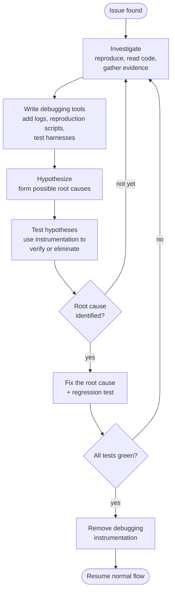
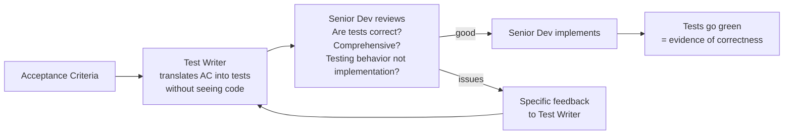
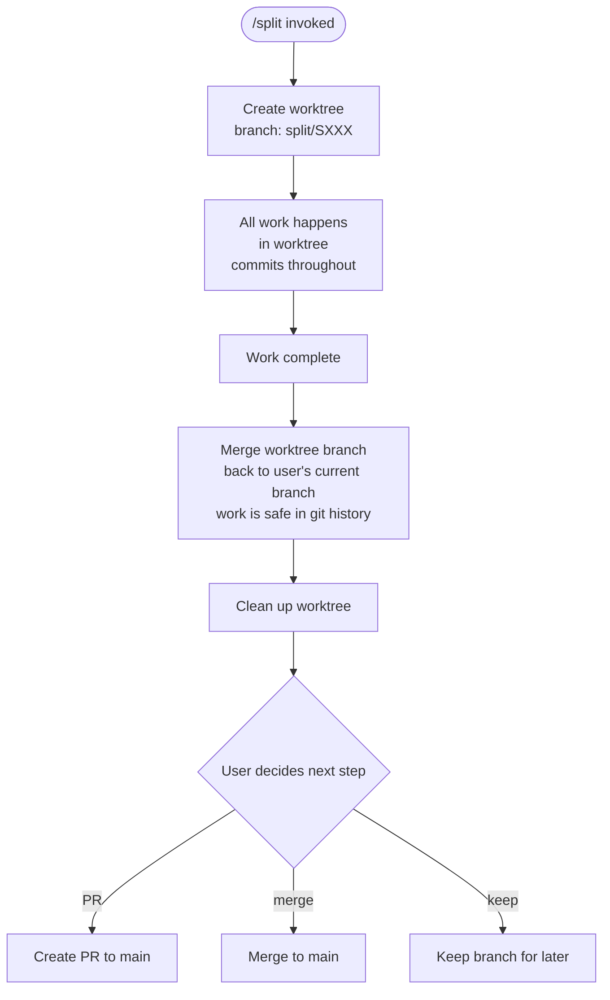

# Split — End-to-End Flow Diagram

## Revised Personas

| Persona | Role | When |
|---------|------|------|
| **SME** | Domain expert, user-facing, spec drafting | Every split (spec phase) |
| **Tech Lead** | Architecture, feasibility, spec review, spec compliance check | Every spec + compliance review |
| **Test Writer** | Writes tests from acceptance criteria before implementation | Code tickets |
| **Senior Dev** | Implements work, reviews test correctness, debugging | Code changes, debugging |
| **Code Reviewer** | Reviews code quality, patterns, maintainability | After implementation |
| **Verifier** | Final verification — acceptance criteria met, everything works | Every ticket |
| **Security Reviewer** | Threat modeling, vulnerability analysis | Security-sensitive changes |
| **UX Designer** | UI/UX patterns, accessibility, user flows | User-facing interface work |
| **DevOps** | Infrastructure, CI/CD, deployment, monitoring | Infra changes |
| **Researcher** | Deep investigation — legal, compliance, technical feasibility | Knowledge gathering |
| **Technical Writer** | Documentation, API docs, user guides | Documentation deliverables |

## Main Flow — Code Implementation Ticket

```mermaid
flowchart TD
    Start([User invokes /split]) --> Worktree[Create git worktree<br/>branch: split/SXXX]
    Worktree --> SME_Conv[SME converses with user<br/>clarifying questions, edge cases]
    SME_Conv --> SME_Spec[SME drafts spec]

    SME_Spec --> TL_Review[Tech Lead reviews spec<br/>adversarial: feasibility,<br/>architecture, scope]
    TL_Review -->|concerns| SME_Revise[SME revises spec<br/>may re-engage user]
    SME_Revise --> TL_Review
    TL_Review -->|satisfied| User_Approve{User approves spec?}
    User_Approve -->|changes needed| SME_Conv
    User_Approve -->|approved| Create_Board[Orchestrator classifies<br/>complexity & creates board]

    Create_Board --> Next_Ticket[Pick next unblocked ticket]

    Next_Ticket --> Is_Code{Code ticket?}

    %% === CODE TICKET FLOW ===
    Is_Code -->|yes| TW[Test Writer writes tests<br/>from acceptance criteria<br/>without seeing implementation]
    TW --> Dev_Review_Tests{Senior Dev reviews tests<br/>correct? comprehensive?}
    Dev_Review_Tests -->|issues with tests| TW_Feedback[Feedback to Test Writer<br/>with specific concerns]
    TW_Feedback --> TW
    Dev_Review_Tests -->|tests look good| Dev_Impl[Senior Dev implements<br/>goal: do the right thing<br/>tests going green = evidence]

    Dev_Impl --> Tests_Green{Tests green?}
    Tests_Green -->|no| Debug[Senior Dev debugs<br/>systematic: investigate,<br/>hypothesize, test, fix<br/>writes debugging tools as needed]
    Debug --> Tests_Green
    Tests_Green -->|yes| CR[Code Reviewer reviews<br/>quality, patterns,<br/>maintainability]

    CR -->|blockers| Dev_Fix[Senior Dev addresses<br/>code quality issues]
    Dev_Fix --> CR
    CR -->|pass| TL_Compliance[Tech Lead checks<br/>spec compliance]

    TL_Compliance -->|issues| Dev_Spec_Fix[Senior Dev addresses<br/>spec compliance gaps]
    Dev_Spec_Fix --> TL_Compliance
    TL_Compliance -->|pass| Verify

    %% === NON-CODE TICKET FLOW ===
    Is_Code -->|no| Persona_Work[Assigned persona does work<br/>documentation, design,<br/>research, etc.]
    Persona_Work --> Verify

    %% === VERIFICATION (all tickets) ===
    Verify[Verifier checks<br/>acceptance criteria met?<br/>artifacts correct?<br/>approach adapts to ticket type]
    Verify -->|issues found| Fix_Ticket[Follow-up ticket created<br/>with specific findings]
    Fix_Ticket --> Next_Ticket
    Verify -->|approval gate?| Pending_Approval{User approves?}
    Pending_Approval -->|rejected + feedback| Re_Dispatch[Re-dispatch to persona<br/>with user feedback]
    Re_Dispatch --> Verify
    Pending_Approval -->|approved| Ticket_Done
    Verify -->|pass| Ticket_Done[Ticket done]

    Ticket_Done --> MS_Check{Milestone complete?}
    MS_Check -->|no| Next_Ticket
    MS_Check -->|yes| MS_Validate[Orchestrator validates<br/>milestone deliverables]
    MS_Validate --> User_CP[User milestone checkpoint<br/>brief status update]
    User_CP --> More_MS{More milestones?}
    More_MS -->|yes| Next_Ticket
    More_MS -->|no| Demo

    Demo[Demo: team walks user through<br/>what was done and how<br/>brief, focused on deliverables] --> Merge_Back

    Merge_Back[Merge worktree branch<br/>back to user's branch<br/>work is never left stranded] --> Git_Decision{User decides next step}
    Git_Decision --> PR[Create PR to main]
    Git_Decision --> Merge[Merge to main directly]
    Git_Decision --> Keep[Keep branch for later]

    Git_Decision --> Retro_Check{Retro triggered?}
    Retro_Check -->|yes| Retro[Run retrospective]
    Retro_Check -->|no| End([Done])
    Retro --> End
```

### User Touchpoints

The user is NOT involved in every ticket. Their touchpoints are:

1. **Spec approval** — once, at the start
2. **Approval gates** — only for explicitly flagged high-risk tickets (security, destructive ops, infra). Most tickets do NOT have this.
3. **Milestone checkpoints** — brief status update at milestone boundaries. User confirms "still on track?" but this is lightweight.
4. **Persona questions** — any persona can surface questions when they hit genuine ambiguity. These are ad-hoc, not a gate.
5. **Demo** — at the end, the team walks the user through deliverables. Brief, focused on what was achieved and how.
6. **Git decision** — user decides what to do with the finished branch.

Everything else runs autonomously. The company does its work; the user is the client.

## Debugging Approach

When tests fail or the Verifier finds issues, the Senior Dev follows a systematic methodology. This is a general approach, not a rigid checklist — the dev adapts to the situation:

**Investigate** — Read code, reproduce the issue, gather evidence. Understand what's actually happening before guessing.

**Hypothesize** — Form possible root causes. Don't jump to the first idea.

**Test** — Verify or eliminate hypotheses with targeted checks.

**Write debugging tools** — This is critical. LLMs are excellent at writing and parsing logs. The dev should liberally add logging, write reproduction scripts, create test harnesses — whatever helps isolate the issue. Instrument first, then diagnose.

**Fix** — Address the specific root cause, not symptoms. Write a regression test for the fix.

## Test Correctness Safeguard

The test correctness problem is addressed by the handoff between Test Writer and Senior Dev:

**Key principle:** Tests describe how the system *should behave* (from AGENTS.md: "Tests verify behavior. Code, tests, and comments describe current system state, not the change that was made."). The Test Writer translates requirements into behavioral assertions. The Senior Dev validates the translation is faithful before implementing.

## Non-Code Ticket Verification

The Verifier adapts its approach based on ticket type:

| Ticket Type | Verification Approach |
|---|---|
| **Implementation** | Run tests, check acceptance criteria, test edge cases |
| **Documentation** | Accuracy check against code, completeness, clarity |
| **Design/Approach** | Feasibility check, coverage of requirements, risk identification |
| **Research** | Sources cited, conclusions supported, actionable findings |
| **Threat Model** | Coverage of attack vectors, mitigations specified, nothing hand-waved |
| **UX Wireframes** | User flow completeness, accessibility, consistency with existing patterns |

## Git Workflow

**Safety principle:** Work is always merged back to the user's branch before worktree cleanup. The worktree is a temporary workspace, but the commits are durable in git. The user never loses work because a worktree was forgotten or pruned.

One worktree per `/split` invocation. All agents within a split work in the same worktree since execution is sequential within a spec.
